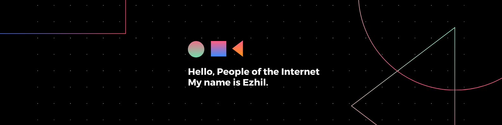

<p align="left">  </p>

[](https://wakatime.com/@e780b5d2-6a76-4fde-a594-4ff159327ad3)

### Tech Stack

[](https://skillicons.dev)

### Social

<p align="left">
	<a href="https://discord.com/users/ezhil56x" target="_blank" rel="noreferrer"
		></a>
	<a href="https://www.github.com/ezhil56x" target="_blank" rel="noreferrer"
		></a>
	<a href="https://git.selfmade.ninja/ezhil930" target="_blank" rel="noreferrer"
		></a>
	<a
		href="https://www.linkedin.com/in/ezhilshanmugham"
		target="_blank"
		rel="noreferrer"
		></a>
	<a href="https://www.twitter.com/ezhil56x" target="_blank" rel="noreferrer"
		></a>
</p>


### Recent Activty ⚡

<!--START_SECTION:activity-->
1. 🗣 Commented on [#1522](https://github.com/tailcallhq/tailcall/issues/1522#issuecomment-2009455266) in [tailcallhq/tailcall](https://github.com/tailcallhq/tailcall)
2. 🗣 Commented on [#55](https://github.com/eronka/culero/issues/55#issuecomment-2009434276) in [eronka/culero](https://github.com/eronka/culero)
3. 🗣 Commented on [#55](https://github.com/eronka/culero/issues/55#issuecomment-2009430868) in [eronka/culero](https://github.com/eronka/culero)
4. 🗣 Commented on [#55](https://github.com/eronka/culero/issues/55#issuecomment-2009427349) in [eronka/culero](https://github.com/eronka/culero)
5. 🗣 Commented on [#128](https://github.com/scratchdata/scratchdata/pull/128#issuecomment-2007854312) in [scratchdata/scratchdata](https://github.com/scratchdata/scratchdata)

<!--END_SECTION:activity-->

### Last 7 Days

<!--START_SECTION:waka-->

```txt
YAML          7 hrs 23 mins   ████████░░░░░░░░░░░░░░░░░   31.37 %
Python        5 hrs 14 mins   █████▓░░░░░░░░░░░░░░░░░░░   22.24 %
TypeScript    4 hrs 28 mins   ████▓░░░░░░░░░░░░░░░░░░░░   18.99 %
Go            2 hrs 41 mins   ███░░░░░░░░░░░░░░░░░░░░░░   11.44 %
Docker        1 hr 18 mins    █▒░░░░░░░░░░░░░░░░░░░░░░░   05.56 %
```

<!--END_SECTION:waka-->

### Github Stats


